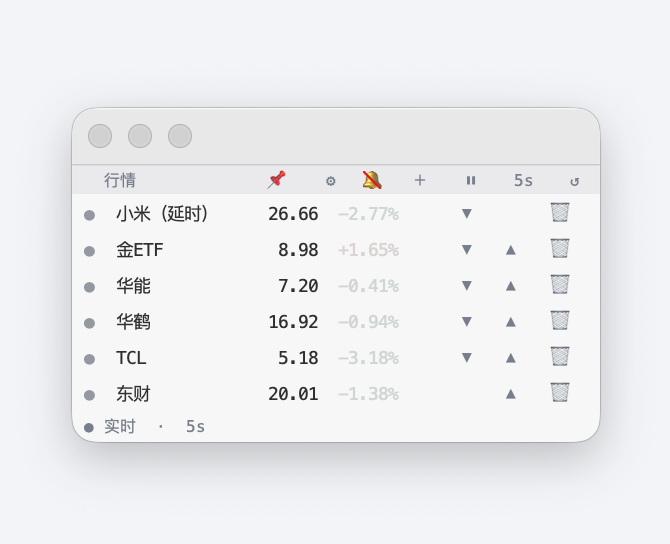
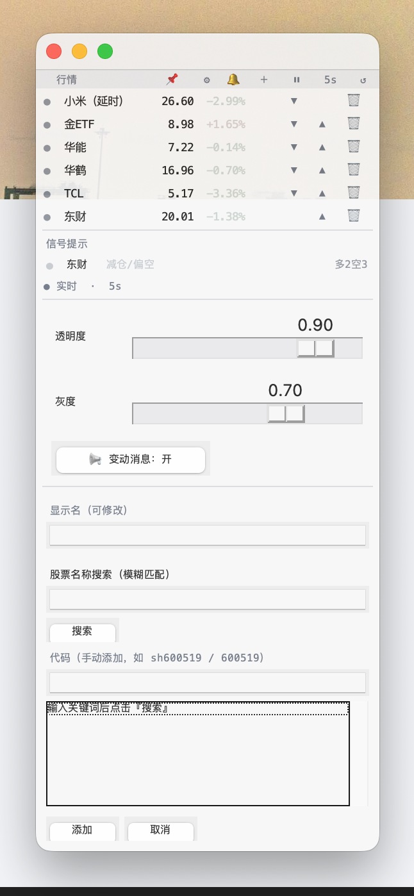

# 股票浮窗 stock_float.py

一个浮动、隐蔽的股票行情 HUD：常驻桌面实时刷新你关注的股票，叠加多空信号打分，异动时弹出系统通知并落盘 CSV。

**纯 Python 标准库 + tkinter，零第三方依赖，单文件即可运行。**

- macOS：双击 `启动浮窗.command`
- Windows：双击 `启动浮窗.bat`
- 通用：`python3 stock_float.py`（需 Python 3.11+，自带 tkinter）





> 实际运行截图：浅色主题浮窗。
> **紧凑视图**（上图）：顶部按钮区（从左到右）为 **📌 置顶** → ⚙️ 设置 → 🔔 显示变动 → ＋ 新增 → ⏸ 暂停 → {Ns} 频率 → ↺ 刷新；行情行显示名称、价格、涨跌幅、排序 ▲▼、删除 🗑；信号提示区与状态栏在下方。
> **展开视图**（下图）：点击 ⚙️ 展开设置面板（透明度 + 灰度滑块），点击 ＋ 展开添加股票面板（搜索 + 手动代码）；两个面板均位于状态栏下方，顶部带分界线与信号提示区对齐。

---

## 功能特性

- **实时行情浮窗**：常驻桌面顶部，半透明、无边框、可拖动。A 股实时行情；港股 / 美股免费源约 15 分钟延时（自动标注"延时"并显示数据时间）。
- **多空信号打分引擎**：基于 MA / RSI / MACD 等指标的加权打分，输出五档信号（买入 / 偏多 / 持有 / 偏空 / 卖出），用颜色圆点直观标识。可扩展 KDJ / BOLL / VOLUME 指标。
- **支撑 / 压力位穿越检测**：为每个股票配置支撑 / 压力价位，价格上穿或下穿时触发系统通知并落盘 CSV（带冷却，避免横跳刷屏）。
- **系统通知（跨平台）**：mac 用 AppleScript、Linux 用 `notify-send`、Windows 用蜂鸣 + 浮窗闪烁。信号变动 / 阈值破位 / 支撑压力穿越时自动提醒。
- **手动排序**：每行右侧 ▲ / ▼ 按钮上下调整顺序，调整后自动持久化到 `stocks.toml`，重启后保持。
- **信号变动聚焦**：信号提示区默认只展示有信号变动的股票（不再提供全部显示开关，始终聚焦变动）。
- **刷新频率切换**：右上角按钮在 1 / 3 / 5 / 10 秒间循环（默认 5s）；切到 1s 时弹窗警告可能被数据源限流 / 封禁。
- **暂停 / 继续**：右上角 ⏸ 随时暂停刷新，再次点击继续。
- **界面置顶开关**：右上角 📌 按钮切换窗口是否常驻最前（默认置顶）；点一下取消置顶，再点恢复。
- **信号提示显隐开关**：右上角 🔔 / 🔕 按钮切换信号提示区是否显示（运行时态，不落盘；关闭时所有信号行隐藏，开启时维持「仅展示有变动」）。
    - **⚙️ 设置面板**：右上角 ⚙️ 打开设置面板，实时拖动调节「透明度 + 灰度」并一键生效、即时持久化到 config.toml（重启保留）。
    - **外观高度可定制**：暗色模式（light / dark / auto 跟随系统）、字号、透明度、涨跌幅配色、信号档位配色、灰度去饱和。
- **命令行回看与统计**：`--review` 回看历史信号（支持按代码 / 日期过滤）、`--stats` 当日信号聚合统计、`--no-log` 不写盘。

---

## 快速开始

```bash
# macOS / 通用：直接运行单文件
python3 stock_float.py

# 回看历史信号（最近 30 条）
python3 stock_float.py --review

# 当日信号聚合统计
python3 stock_float.py --stats

# 按代码 / 日期过滤
python3 stock_float.py --review --code hk01810 --date 2026-07-15
python3 stock_float.py --stats  --code hk01810

# 不写 CSV
python3 stock_float.py --no-log
```

macOS 用户推荐直接双击 `启动浮窗.command`；Windows 用户双击 `启动浮窗.bat`。两个启动器会自动查找 Python 3.11+（含 tkinter），无需手动配置环境。

---

## 配置

配置文件放在脚本同级目录，共两个：

- **`config.toml`**：浮窗外观、通知、落盘存储、运行参数（行情源 / 刷新频率）。
- **`stocks.toml`**：监控策略（指标打分 / 盘中灵敏）+ 变动阈值 / 冷却，以及股票列表 `[[stocks]]`（含个股 `support` / `resistance`）。

> **归属约定**：`stocks.toml` 的 `[settings]` 放**监控策略 + 变动阈值 / 冷却**；`config.toml` 的 `[settings]` 放**外观 / 通知 / 落盘存储 + 运行参数**。同一键两处都有时，`stocks.toml` 优先。在 `config.toml` 里写监控策略键（如 `indicators`）仍可用，只是官方归属在 `stocks.toml`。

### `config.toml` 配置键（外观 / 通知 / 落盘 / 运行参数）

| 键 | 默认 | 说明 |
|----|------|------|
| `csv_mode` | `"daily"` | `daily` 按天滚动到 `signals_YYYY-MM-DD.csv` |
| `csv_dedup_sec` | `60` | CSV 去重窗口（秒），0 = 关闭；同 code 且 signal/price 未变则跳过 |
| `notify` | `false` | 跨平台系统通知开关 |
| `notify_sound` | `false` | 通知声音（Windows 用蜂鸣兜底） |
| `sources` | `["tencent","sina","eastmoney"]` | 行情源兜底顺序；设 `["tencent"]` 关备用源 |
| `refresh_sec` | `5` | 刷新周期（秒），浮窗内频率控件循环 1/3/5/10s 覆盖 |
| `topmost` | `true` | 窗口是否始终置顶（always-on-top）；false = 启动不置顶（或点 📌 临时切换） |
| `float_theme` | `"light"` | light / dark / auto（auto 跟随系统外观） |
| `float_font` | `"Menlo"` | 字体族 |
| `float_font_size` | `7` | 字号 |
| `float_up_color` / `float_down_color` | 内置默认 | 涨 / 跌色（#RRGGBB） |
| `sig_buy` / `sig_long` / `sig_hold` / `sig_short` / `sig_sell` | 内置默认 | 五档信号色 |
| `float_alpha` | `0.94` | 浮窗透明度（0~1） |
| `grayness` | `0.0` | 界面强调色去饱和程度 0.0~1.0；0 = 原色，1 = 纯灰阶 |

### `stocks.toml` 配置键（监控策略 / 阈值 / 冷却）

| 键 | 默认 | 说明 |
|----|------|------|
| `indicators` | `["MA","RSI","MACD"]` | 参与打分的指标；可加 `KDJ` / `BOLL` / `VOLUME` |
| `live_indicators` | `true` | 盘中把实时价并入指标序列 |
| `chg_alert` / `swing_alert` | `0` | 变动 / 波动提示阈值（%） |
| `alert_cooldown` | `15` | 阈值 / 支撑压力穿越冷却（分钟） |

### 个股支撑 / 压力

在 `stocks.toml` 的 `[[stocks]]` 里加（可多个价位）：

```toml
[[stocks]]
code = "hk01810"
name = "小米集团-W"
support = [18.0, 17.5]        # 价格下穿任一时弹通知 + 写 CSV
resistance = [20.5, 21.0]     # 价格上穿任一时弹通知 + 写 CSV
```

穿越判定用"前价 vs 现价"对比价位，并复用 `alert_cooldown` 冷却。需 `notify=true` 才弹通知；CSV 落盘独立生效。

---

## 多市场

- **A 股**（`sh` / `sz`）：实时行情。
- **港股**（`hk`）/ **美股**（`us`）：免费源约 15 分钟延时，浮窗标"延时"并显示接口数据时间。

---

## 已知限制

- **备用源字段映射需实测**：新浪（`hq.sinajs.cn`，需 `Referer`）与东财（`push2.eastmoney.com`，`secid` 编码 `hk→116.x` / `us→105.x` / `sh→1.x` / `sz→0.x`，价格 ÷100）的字段映射按常见口径实现，未逐源联调。任一备用源不可达时主源（腾讯）仍正常；如不可用可在 `sources` 中删去对应项。
- **腾讯实时 `volume` 字段**：先按 `p[6]`（手数）实测；若接口返回结构不符会回退 `volume=None` 且不报错。
- **KDJ 简化口径**：用收盘价版 RSV（非严格 high/low 版）。
- **VOLUME 历史量**：默认关（`indicators` 不含 `"VOLUME"`）；启用时额外拉一次日 K 量（多一次请求 / 股）。
- **Windows 闪烁**：无边框窗口采用 alpha 取反闪烁约 1s 兜底（不做 ctypes Toast）。
- **GUI 交互需真机验证**：跨平台通知、暂停 / 频率、暗色、闪烁、手动排序等均需在对应系统实机验证（本环境无法启动 GUI）。
- **零第三方依赖**：仅标准库（`tkinter` / `subprocess` / `winsound` / `winreg` / `zoneinfo` / `tomllib`(3.11+) 等）。

---

## 开发与测试

核心指标与逻辑以纯函数实现（如 `sma` / `rsi` / `macd` / `kdj` / `bollinger`），可用 `unittest` 无头测试：

```bash
python3 -m unittest test_stock_float
```

建议测试点：

1. **纯函数指标单测**：`sma` / `rsi` / `macd` 确定性 & 边界（数据不足返回 None）。
2. **默认行为回归**：不配置 `indicators` 时打分 / 信号档位与内置默认一致；实时 / 日 K / 五档信号 / CSV / `--review` / 多市场原样工作。
3. **跨平台通知分支**：mac / linux / win 各自 `Notifier.notify` 分支；Windows 蜂鸣 + 闪烁经 `root.after` 线程安全。
4. **CSV 去重**：`csv_dedup_sec` 窗口内同 code + signal + price 跳过；窗口外或变动则写入。
5. **`--stats` / `--review` 过滤**：`--code` / `--date` 正确筛选；`csv_mode="daily"` 聚合当日 `signals_YYYY-MM-DD.csv`。
6. **多源兜底**：主源失败顺序尝试备用；主源异常仅告警一次（stderr）。
7. **手动排序与持久化**：`move_stock_in_order` 边界正确；调序后 `stocks.toml` 顺序同步。
