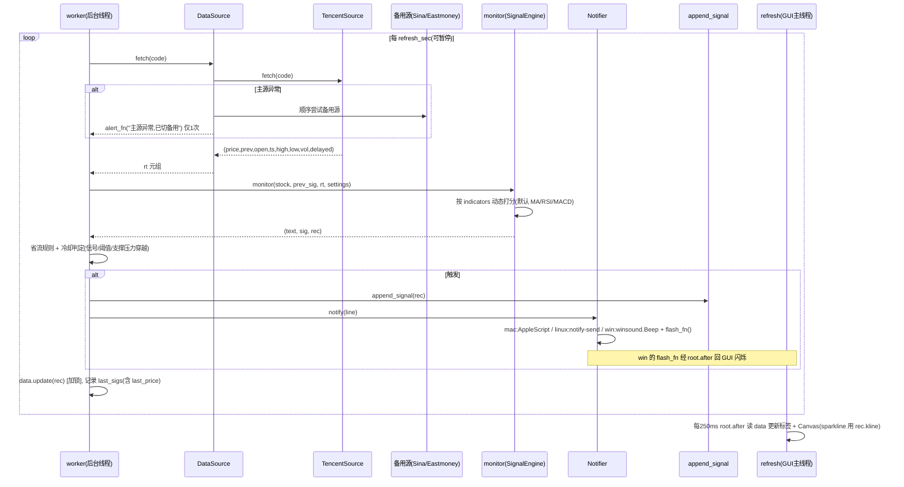

# 股票浮窗 `stock_float.py` 增量功能 — 系统架构设计 + 任务分解

> 架构师：高见远（Bob）｜ 目标：为 8 项增量功能给出可直接照图施工的设计
> 约束：纯 Python 标准库 + tkinter，零第三方依赖，保持单文件双击可运行，既有行为默认完全一致

---

## 1. 实现方案 + 框架选型

### 技术基线（确认）
- **语言/运行时**：Python 3（兼容 3.11+ 的 `tomllib`；旧版本自动降级跳过 toml）。
- **GUI**：标准库 `tkinter`（无边框 + 置顶 + 半透明），**不引入任何第三方 UI 库**。
- **数据**：免费公开 HTTP 接口（腾讯 `qt.gtimg.cn` + 日K `ifzq.gtimg.cn`），备用源同样为免费公开接口。
- **依赖**：**零第三方包**（仅标准库：`subprocess`、`winsound`(Win)、`winreg`(Win)、`tkinter`、`zoneinfo` 等）。完全离线可用（除联网取行情本身）。

### 架构风格
保持**单文件 `stock_float.py`**，但把"扁平函数"重构成**同文件内的「段/类」**，满足用户已拍板的决策 4（允许段/类抽取，仍单文件可运行）。不做跨文件模块化。

| 抽象层 | 形式 | 职责 | 改造影响 |
|--------|------|------|----------|
| 数据源 | `DataSource` + `RealTimeSource` 子类 | 统一返回 `(price, prev_close, open_px, ts, high, low, volume, delayed)`；主源失败顺序尝试备用源 | 包住现有 `get_realtime`，签名升级为 8 元组 |
| 通知 | `Notifier` | `notify(msg)` 按平台分发 mac/linux/windows，Windows 走"蜂鸣+闪烁" | 替换现有仅 mac 的 `notify_mac` 直连 |
| 指标 | `Indicator`（命名空间纯函数） | `sma/ema_series/rsi/macd` 保留；新增 `kdj/bollinger`；`indicators` 配置映射到计算 | 纯增量，默认关 |
| 信号引擎 | `SignalEngine`（包住 `monitor`） | 打分从"写死"改"按 `indicators` 动态累加"，默认仅 MA/RSI/MACD 时与现有一致 | 核心改动 |
| 界面 | `Hud`（包住 `run_hud`） | 无边框浮窗；sparkline Canvas、⏸ 暂停、频率控件、暗色样式、Windows 闪烁 | 增量控件 |
| 配置/落盘 | 现有函数扩展 | 新增 settings 键、stocks.toml `support/resistance`、CSV 去重/`--stats`/`--review` 过滤 | 增量 |

**取舍理由**
- 用"同文件类"而非跨文件：满足单文件双击可运行 + 离线，避免 `import` 路径问题。
- `DataSource` 抽象：把"多源兜底"与"解析异常告警"收敛到一处，主源失败不影响既有监控；默认启用免费备用源（决策 1、5：仅免费源、默认开、无 token）。
- `monitor` 动态打分：用「指标名 → 打分函数」注册表，默认 `indicators=["MA","RSI","MACD"]` 精确复刻当前权重（决策 3：一步到位，但默认行为不变）。
- Windows 通知用"蜂鸣+闪烁"而非 ctypes Toast（决策 2）：`winsound.Beep` 在后台线程调用（阻塞 ~0.2s 可接受），闪烁经 `root.after` 回到 GUI 线程，绕开线程安全问题。

---

## 2. 文件列表及相对路径

单文件为主，新增少量辅助文件（均放 `stock_float.py` 同级）：

| 文件 | 状态 | 说明 / 修改区段 |
|------|------|----------------|
| `stock_float.py` | **修改** | 主程序。内部区段重排：① 引擎常量 ② 数据源层(`DataSource`/`*Source`) ③ 工具 ④ 指标(`Indicator`) ⑤ 信号引擎(`SignalEngine`/`monitor`) ⑥ 配置加载 ⑦ CSV/回看 ⑧ 通知(`Notifier`) ⑨ 样式(`build_style`) ⑩ GUI(`Hud`/`run_hud`) ⑪ `main()` |
| `config.toml.example` | **新增** | 配置示例：含全部 settings 键（含新增 `refresh_sec`/`float_theme`/`float_font`/`float_font_size`/`indicators`/`sources`/`csv_dedup_sec`）+ 默认值与注释 |
| `stocks.toml.example` | **新增** | 股票示例：含 `[[stocks]]` 的 `support`/`resistance` 写法注释 |
| `README.md` | **新增** | 使用说明 + 8 项新功能开关说明 + 离线/多市场注意事项 |
| `docs/system_design.md` | **新增** | 本设计文档 |
| `docs/class-diagram.mermaid` | **新增** | 类图 |
| `docs/sequence-diagram.mermaid` | **新增** | 时序图 |

> 代码修改集中在 `stock_float.py` 内部；为安全保留既有函数名作为兼容别名（如 `get_realtime` 委托给 `DATA_SOURCE.fetch`），避免引用处大面积改动。

---

## 3. 数据结构和接口（类图 + 签名）

### 3.1 数据源层 `DataSource`

```python
from typing import Tuple
RT = Tuple[float, float, float, str, float, float, float, bool]
#   (price, prev_close, open_px, ts, high, low, volume, delayed)

class RealTimeSource:
    name: str
    def fetch(self, code: str) -> RT: ...   # 失败抛异常

class TencentSource(RealTimeSource):
    # URL: https://qt.gtimg.cn/q={code}
    # 解析: raw.split('"')[1].split("~"); [3]现价 [4]昨收 [5]今开
    #       [33]最高 [34]最低 [6]成交量(手,需实测确认) ; ts: p[-1] 或 p[30]
    # delayed = is_delayed(code)  # 港股/美股延时
    def fetch(self, code: str) -> RT: ...

class SinaSource(RealTimeSource):           # 备用免费源
    # URL: https://hq.sinajs.cn/list={code}  (需带 Referer: https://finance.sina.com.cn)
    # 解析: "var hq_str_xxx=\"名,今开,昨收,现价,买一,...,最高,最低,...\"" 逗号分隔
    # 字段映射待联调: [1]名 [2]今开 [3]昨收 [6]现价 [4]?最高 [5]?最低 [8]成交量
    # delayed: 新浪港股/美股同样延时 -> is_delayed(code)
    def fetch(self, code: str) -> RT: ...

class EastmoneySource(RealTimeSource):      # 备用免费源
    # URL: https://push2.eastmoney.com/api/qt/stock/get?secid={secid}&fields=f43,f44,f45,f46,f47,f57,f58,f86
    # secid 编码: hk->116.{num}, us->105.{num}, sh->1.{num}, sz->0.{num}
    # 返回 JSON: f43现价(分)/100 f44最高 f45最低 f46今开 f60昨收 f47成交量(手) f86时间(秒)
    # delayed: 依市场判定 is_delayed(code)
    def fetch(self, code: str) -> RT: ...

class DataSource:
    def __init__(self, sources: list[RealTimeSource] | None = None,
                 alert_fn: callable[[str], None] | None = None):
        self.sources = sources or [TencentSource(), SinaSource(), EastmoneySource()]
        self.alert_fn = alert_fn          # 主源失败时回调一次(数据源告警)
        self._alerted = False
    def fetch(self, code: str) -> RT:
        # 顺序尝试 sources; 主源(索引0)异常且仅告警一次; 全失败抛最后一个异常
        ...

# 兼容别名(保持既有调用点不动)
def get_realtime(code: str) -> RT:
    return DATA_SOURCE.fetch(code)
```

### 3.2 通知层 `Notifier`

```python
class Notifier:
    def __init__(self, enabled: bool, sound: bool = False,
                 flash_fn: callable[[], None] | None = None):
        self.enabled = enabled     # settings.notify
        self.sound = sound         # settings.notify_sound
        self.flash_fn = flash_fn   # Windows 闪烁: 由 GUI 注入, 内部用 root.after 调度
    def notify(self, msg: str) -> None:
        if not self.enabled: return
        if sys.platform == "darwin":
            notify_mac(msg, self.sound)            # 既有 AppleScript
        elif sys.platform.startswith("linux"):
            self._notify_linux(msg)                # subprocess notify-send
        else:
            self._notify_windows(msg)              # winsound.Beep + flash_fn
    def _notify_linux(self, msg):
        subprocess.run(["notify-send", "股票HUD", msg], timeout=5, ...)
    def _notify_windows(self, msg):
        try:
            import winsound
            winsound.Beep(880, 200)                # 后台线程调用, 阻塞~0.2s 可接受
        except Exception: pass
        if self.flash_fn: self.flash_fn()          # 经 root.after 回到 GUI 线程
```

> **Windows 线程安全**：worker 在后台线程，`winsound.Beep` 是阻塞系统调用可在后台线程直接跑；闪烁必须触碰 GUI，故由 GUI 注入 `flash_fn`，`flash_fn` 内部用 `root.after(0, _flash)` 把 GUI 操作排回主线程。`Notifier` 本身不持有 `tk` 对象。

### 3.3 指标层 `Indicator`（纯函数，含扩展）

```python
# 现有一致保留
def sma(vals, n): ...
def ema_series(vals, n): ...
def rsi(closes, n=14): ...                       # -> float|None
def macd(closes, fast=12, slow=26, sig=9): ...   # -> (dif,dea,hist,prev_hist)

# 新增扩展(默认不计入打分, 由 settings.indicators 开启)
def kdj(closes, n=9, k_period=3, d_period=3) -> Tuple[float,float,float]|None:
    """简化 KDJ: 用收盘序列算 RSV=(C-min(Cn))/(max(Cn)-min(Cn))*100;
    返回 (k, d, j)。注: 严格 KDJ 需每日 high/low, 此处采用收盘价版 RSV(常见简化)。"""

def bollinger(closes, n=20, k=2) -> Tuple[float,float,float]|None:
    """返回 (mid, upper, lower)。"""

def get_volume_hist(code) -> list[float] | None:
    """(可选)返回历史每日成交量(手)序列; 由 _fetch_kline_raw 扩展返回量。
    仅当 indicators 含 'VOLUME' 时调用, 默认关闭不影响请求量。"""
```

**`indicators` 配置 → 计算映射**（注册表）：

```python
INDICATORS_AVAILABLE = ["MA", "RSI", "MACD", "KDJ", "BOLL", "VOLUME"]
DEFAULT_INDICATORS   = ["MA", "RSI", "MACD"]
```

### 3.4 信号引擎 `SignalEngine` / `monitor` 改造（动态打分）

```python
# 打分函数注册表: 每个返回 (delta_bull, delta_bear, reasons:list[str])
SCORERS = {
  "MA":     _score_ma,      # 价>MA5 / MA5>MA10 / MA10>MA20 (各 ±1)  —— 与现有完全等价
  "RSI":    _score_rsi,     # RSI<35 +1 / >65 -1
  "MACD":   _score_macd,    # 红柱+1/绿柱-1; 金叉+2/死叉-2
  "KDJ":    _score_kdj,     # K>D +1 / K<D -1; J<0 +1 / J>100 -1; 金叉+2/死叉-2  (默认关)
  "BOLL":   _score_boll,    # 价<下轨 +1(超卖) / 价>上轨 -1(超买)                 (默认关)
  "VOLUME": _score_volume,  # 量>1.5×量MA5 +1(放量) / <0.5× -1(缩量)             (默认关)
}

def monitor(stock, prev_sig=None, rt=None, settings=None) -> Tuple[str,str,dict]:
    code, name = stock["code"], stock["name"]
    delayed = is_delayed(code)
    trading = is_trading_time(datetime.now(HKT), market_of(code))
    if rt is None: rt = get_realtime(code)
    price, prev_close, open_px, ts, high, low, volume, delayed = rt
    closes = get_kline(code)
    ind = (list(closes[:-1]) + [price]) if (LIVE_INDICATORS and closes) else (list(closes) or [price])

    indicators = (settings or {}).get("indicators") or DEFAULT_INDICATORS
    vals = {}
    if "MA" in indicators:     vals["ma5"],vals["ma10"],vals["ma20"] = sma(ind,5),sma(ind,10),sma(ind,20)
    if "RSI" in indicators:    vals["rsi"] = rsi(ind)
    if "MACD" in indicators:   vals["dif"],vals["dea"],vals["hist"],vals["prev_hist"] = macd(ind)
    if "KDJ" in indicators:    vals["k"],vals["d"],vals["j"] = kdj(ind)
    if "BOLL" in indicators:   vals["boll_mid"],vals["boll_up"],vals["boll_low"] = bollinger(ind)
    if "VOLUME" in indicators: vals["vol"],vals["vol_ma5"] = volume, _vol_ma5(code, volume)

    bull = bear = 0; reasons = []
    for name in indicators:
        db, dbear, rs = SCORERS[name](price, vals)
        bull += db; bear += dbear; reasons += rs

    net = bull - bear
    sig = map_signal(net, prev_sig)
    rec = { ... 既有字段 ...,
            "k":..., "d":..., "j":..., "boll_mid":..., "boll_up":..., "boll_low":...,
            "volume": volume, "vol_ma5": vals.get("vol_ma5",""),
            "kline": list(closes[-30:]),   # 供 sparkline; 不在 CSV_FIELDS 内
            "delayed": delayed, "ts": ts }
    return text, sig, rec
```

> **默认一致性保证**：当 `indicators == ["MA","RSI","MACD"]` 时，`SCORERS` 的权重与现有 `monitor` 第 360–377 行逐字等价（MA 三多三空、RSI 超买超卖、MACD 红绿柱+金死叉 +2/-2），`map_signal` 阈值不变 → 信号档位与 CSV 输出与当前字节级一致。

### 3.5 样式 `build_style`（暗色/字号）

```python
LIGHT_PALETTE = {"bg":"#f7f7f7","fg":"#1a1a1a","fg_dim":"#6b7280","up":"#d93025",
                 "down":"#188038","flat":"#8a8f98","dl":"#b06a2c","header":"#e9e9ec","sep":"#d8dadf"}
DARK_PALETTE  = {"bg":"#1e1e22","fg":"#e8e8ea","fg_dim":"#9aa0a6","up":"#ff6b5e",
                 "down":"#4cc38a","flat":"#7b818a","dl":"#d99a4e","header":"#2a2a30","sep":"#3a3a42"}

def detect_system_theme() -> str:   # 'light' | 'dark'
    # mac: subprocess 读 defaults read Apple Global Domain AppleInterfaceStyle -> "Dark"
    # win: winreg 读 HKEY_CURRENT_USER\...\Themes\Personalize AppsUseLightTheme (0=dark)
    # 其它: 回退 'light'

def build_style(settings) -> dict:
    theme = settings.get("float_theme", "light")
    if theme == "auto": theme = detect_system_theme()
    pal = DARK_PALETTE if theme == "dark" else LIGHT_PALETTE
    font = settings.get("float_font") or "Menlo"
    size = int(settings.get("float_font_size") or 7)
    return {"bg":pal["bg"],"fg":pal["fg"],"fg_dim":pal["fg_dim"],"up":pal["up"],
            "down":pal["down"],"flat":pal["flat"],"dl":pal["dl"],"header":pal["header"],
            "sep":pal["sep"],"sig_colors":{...},   # 暗色下可选微调
            "FONT":(font,size),"FONT_SM":(font,max(5,size-1)),"ROW_H":16}
```

### 3.6 新增 settings 键（默认值均保持既有体验）

| 键 | 默认 | 说明 |
|----|------|------|
| `refresh_sec` | `1` | 浮窗刷新周期(可选 1/3/5) |
| `notify` | `False` | 现仅 mac；**改造后跨平台**(mac/linux/win) |
| `notify_sound` | `False` | 同上 |
| `float_theme` | `"light"` | light/dark/auto |
| `float_font` | `"Menlo"` | 字体族 |
| `float_font_size` | `7` | 字号 |
| `indicators` | `["MA","RSI","MACD"]` | 参与打分的指标列表 |
| `sources` | `["tencent","sina","eastmoney"]` | 启用的行情源(可删减以关备用源) |
| `csv_dedup_sec` | `60` | CSV 去重窗口(秒) |
| 既有键 | 不变 | `csv_mode`/`float_up_color`/`float_down_color`/`sig_*`/`float_alpha`/`chg_alert`/`swing_alert`/`alert_cooldown`/`live_indicators` |

`stocks.toml` 个股新增（可选，决策保持默认关闭）：
```toml
[[stocks]]
code = "hk01810"
name = "小米集团-W"
support = [18.0, 17.5]      # 支撑预警价(可多个)
resistance = [20.5, 21.0]   # 压力预警价(可多个)
```

---

## 4. 程序调用流程（时序图）

一次刷新周期内 `worker → 各源 → monitor → SignalEngine → Notifier/CSV`，以及 Windows 闪烁如何线程安全到达 GUI：



**暂停/频率**：`worker` 读共享 `state={"paused":False,"refresh_sec":1}`；`paused` 为真则跳过 `fetch` 仅 `sleep(refresh_sec)`；⏸ 按钮与频率循环控件改 `state`。
**支撑压力穿越**：`worker` 用 `last_sigs[code]["last_price"]` 与前价比较，对每只 `support/resistance` 价做"上穿/下穿"判定（复用 `cross_*` + 冷却逻辑），命中即触发通知 + CSV（`reasons` 追加"突破阻力X"/"跌破支撑X"）。

---

## 5. 任务列表（有序、含依赖、按实现顺序）

> 规则：≤5 个任务、每任务 ≥3 个文件、首个任务=基础设施、尽量仅依赖 T01。

### T01 — 架构骨架与抽象层（无行为变更）　`P0`
- **源文件**：`stock_float.py`、`config.toml.example`、`stocks.toml.example`、`README.md`
- **依赖**：无
- **内容**：
  1. 在 `stock_float.py` 内重排为「段/类」：`DataSource`/`RealTimeSource` 子类、`Notifier`、`Indicator`（纯函数）、`SignalEngine`（包 `monitor`）、`Hud`（包 `run_hud`）、`build_style`。
  2. `get_realtime` 改为委托 `DATA_SOURCE.fetch`，返回**8 元组**（新增 `volume`、`delayed`），既有调用点（`fetch_realtime_batch`/`monitor`/`run_hud`）同步升级解包。
  3. 落地全部新增 `settings` 键与默认值；`stocks.toml` 解析 `support`/`resistance` 透传。
  4. 新增示例配置与 README。
  5. **验收**：`python3 stock_float.py` 行为与改造前逐字一致（默认 `indicators` 未配 → 走 MA/RSI/MACD）。

### T02 — P0 交互三件套：sparkline + 暂停/频率 + 跨平台通知　`P0`
- **源文件**：`stock_float.py`、`config.toml.example`、`README.md`
- **依赖**：T01
- **内容**：
  1. `Notifier` 跨平台分发：mac→`notify_mac`；linux→`notify-send`(subprocess)；win→`winsound.Beep` + `flash_fn`(GUI 注入，`root.after` 闪烁)。
  2. `run_hud` 加共享 `state{"paused","refresh_sec"}`；顶栏加 ⏸ 按钮（暂停/继续）与频率循环控件（1→3→5→1）；worker 按 `state` 跳过取数/调速。
  3. 每行行情加 ~50px `tk.Canvas`；`refresh` 用 `rec["kline"]`（日K近30根+实时价）画折线，色随 `price vs prev_close`。
  4. `monitor` 把 `kline` 写入 `rec`（不在 CSV 字段内）。
- **优先级**：P0（用户最易感知）

### T03 — P1 数据/信号引擎增强：多源兜底 + 指标扩展 + 支撑压力线　`P1`
- **源文件**：`stock_float.py`、`config.toml.example`、`stocks.toml.example`
- **依赖**：T01
- **内容**：
  1. 实现 `SinaSource`/`EastmoneySource`，`DataSource` 按 `sources` 顺序兜底；主源异常经 `alert_fn` 仅告警一次（非静默跳过）。
  2. 新增 `kdj`/`bollinger` 纯函数；可选 `get_volume_hist`（扩展 `_fetch_kline_raw` 返回量，默认关）。
  3. `monitor` 改为按 `indicators` 动态累加打分（注册表 `SCORERS`），默认 `["MA","RSI","MACD"]` 与现有一致；开启 KDJ/BOLL/VOLUME 时参与打分。
  4. `worker` 实现支撑/压力穿越检测（复用 `cross_*`+冷却），命中触发通知 + CSV（`reasons` 追加）。
- **优先级**：P1（架构改动最大，放 T02 后稳定推进）

### T04 — P1 暗色模式与字号字体　`P1`
- **源文件**：`stock_float.py`、`config.toml.example`、`README.md`
- **依赖**：T01
- **内容**：
  1. `build_style(settings)` 生成 `StyleSet`（LIGHT/DARK 调色板 + `FONT`/`FONT_SM`/`ROW_H`）。
  2. `detect_system_theme()`：mac 用 `subprocess` 读 `defaults`，win 用 `winreg` 读 `AppsUseLightTheme`。
  3. `run_hud` 全部样式常量改为读取 `StyleSet`，支持 `float_theme`(light/dark/auto) + `float_font` + `float_font_size`。
- **优先级**：P1（纯样式，独立）

### T05 — P1 落盘与查询增强：CSV 去重/聚合/stats/review 过滤　`P1`
- **源文件**：`stock_float.py`、`config.toml.example`、`README.md`
- **依赖**：T01
- **内容**：
  1. `append_signal` 去重：同 `code` 且 `signal`/`price` 未变且在 `csv_dedup_sec` 窗口内则跳过（模块级 `_LAST_ROW` 缓存）。
  2. 新增 `--stats`：聚合当日 CSV（各档位出现次数、最大/最小 `net`、信号切换次数）打印表格。
  3. `--review` 支持 `--code` / `--date` 过滤；`review_csv` 按过滤条件筛选。
- **优先级**：P1（落盘层，独立）

### 建议实现顺序
**T01 → T02 → T03 → T04 → T05**
- T01 必须先做（所有功能依赖抽象层）。
- T02 为 P0，优先交付用户可感知的 sparkline/暂停/跨平台通知。
- T03 是数据/信号核心（决策 3 的一步到位），紧随其后。
- T04、T05 相互独立，可并行或按团队产能排期。

---

## 6. 依赖包列表

**零第三方依赖**。仅使用 Python 标准库：

```
# 标准库(无需安装)
tkinter          # GUI(已是既有依赖)
subprocess       # mac AppleScript / linux notify-send 调用
winsound         # Windows 系统蜂鸣(仅 Windows 导入)
winreg           # Windows 读系统外观(仅 Windows 导入)
zoneinfo         # 美股时区(既有, 3.9+ 内置)
tomllib          # toml 解析(3.11+ 内置; 旧版跳过)
csv / json / re / os / sys / time / threading / argparse / urllib.request
```

> 不引入 `yaml`/`toml` 第三方包（既有 `_load_first` 对 yaml 用 `import yaml` 惰性导入，非硬性依赖；本设计不新增 yaml 需求）。

---

## 7. 共享知识（跨"模块"约定）

### 7.1 `rec` 字典字段约定
- **既有字段（不变）**：`datetime, code, name, price, chg_pct, open, prev_close, ma5, ma10, ma20, rsi, macd_dif, macd_dea, macd_hist, bull, bear, net, signal, reasons, delayed, ts`（外加 `swing_pct`）。
- **新增指标字段（追加到 `CSV_FIELDS` 尾部，向后兼容旧 CSV）**：`k, d, j, boll_mid, boll_up, boll_low, volume, vol_ma5`。
- **仅运行时、不入 CSV 的字段**：`kline`（sparkline 用，近 30 根日K收盘）。
- `reasons` 在 `append_signal` 中用 `;` 连接（既有约定保留）。

### 7.2 settings 键约定
- 新增键见 §3.6，默认值均保证「不配置 = 既有行为」。
- `indicators` 未配置或为空 → 强制 `DEFAULT_INDICATORS = ["MA","RSI","MACD"]`。
- `sources` 未配置 → 全启用免费源；用户可设 `["tencent"]` 关闭备用源（外网合规，决策 5）。
- `support`/`resistance` 仅在 `stocks.toml` 个股层级，不在全局 settings。

### 7.3 接口约定
- `DataSource.fetch(code) -> (price, prev_close, open_px, ts, high, low, volume, delayed)`，失败抛异常；主源失败顺序尝试备用源。
- `Notifier.notify(msg)`：跨平台分发；Windows 闪烁必须经 `flash_fn`（GUI 注入，内部 `root.after`）回主线程。
- `Indicator` 纯函数无副作用；新增 `kdj`/`bollinger` 返回 `(k,d,j)`/`(mid,up,low)` 或 `None`（数据不足）。
- `monitor(stock, prev_sig, rt, settings)`：`settings` 控制 `indicators`；返回 `(text, sig, rec)`。

### 7.4 线程安全约定
- `data`（code→rec）与 `last_sigs` 由 `lock = threading.Lock()` 保护；worker 写、refresh 读均加锁（既有约定，T02/T03 继承）。
- **GUI 操作只能在主线程**：`refresh`/`root.after` 回调改标签与 Canvas；后台 worker 不得直接 `config`。
- Windows 蜂鸣在后台线程直接 `winsound.Beep`（阻塞 ~0.2s 可接受）；闪烁由 `flash_fn` 经 `root.after` 回主线程。
- `get_kline` 有 30min 缓存，worker 调用安全；GUI 侧 sparkline 直接用 `rec["kline"]`，**不**在 refresh 内触发网络请求（避免卡 UI）。

---

## 8. 待明确事项

1. **腾讯实时 `volume` 字段索引**：疑似 `p[6]`（成交量，单位手），需实盘联调确认；新浪/东财字段映射同样需实测。
2. **KDJ 口径**：本设计用「收盘价版 RSV」简化实现（非严格 high/low 版）。如需严格版，需扩展 `_fetch_kline_raw` 同时返回每日 high/low（增加少量请求），请确认是否采用严格版。
3. **VOLUME 指标的历史量**：默认关闭；启用需 `_fetch_kline_raw` 额外返回成交量序列（多一次请求/股）。是否值得做"量MA5 放量/缩量"打分？或仅显示当日量不进打分？
4. **备用源可用性**：新浪需 `Referer: https://finance.sina.com.cn`；东财 `secid` 编码（`hk→116.x / us→105.x / sh→1.x / sz→0.x`）需实测。若某备用源在你网络环境不可达，可在 `sources` 中删去。
5. **Windows 闪烁效果**：无边框窗口无法用标题栏闪，采用「alpha 或 bg 取反」闪烁 ~1s。请确认该视觉反馈是否可接受（决策 2 已拍板不做 ctypes Toast）。
6. **`--stats` 聚合文件**：`csv_mode="daily"` 时聚合哪个文件（当日 `signals_YYYY-MM-DD.csv` 还是全部）？默认聚合「当日 signals.csv 或当日 daily 文件」。
7. **多指标下的 `map_signal` 阈值**：启用 KDJ/BOLL/VOLUME 后 `net` 量级变化，是否需对阈值做自适应或提供用户可调参数（如 `signal_thresholds`）？当前设计保留原阈值不变。

---

> 附：类图见 `docs/class-diagram.mermaid`，时序图见 `docs/sequence-diagram.mermaid`。
